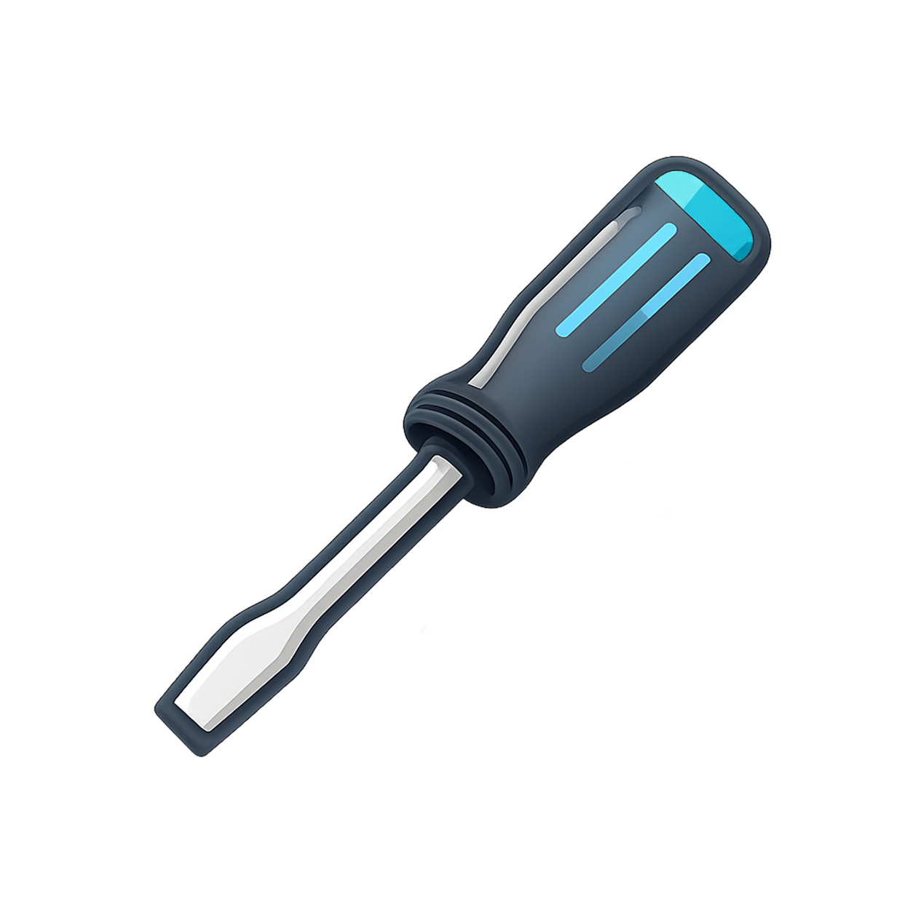

<div dir="rtl" align="center">
  
  <h1>دوسو (Dosu)</h1>
  <p>یک رپر مدرن و کراس‌پلتفرم برای ترمینال با پشتیبانی از متن دوزبانه — پروژه‌ای از راست‌نگار</p>
  <br>
  <p>
    
    
    
    
  </p>
  <br>
  <p>
    <a href="README.md" dir="ltr">English</a> •
    <b>فارسی</b> •
    <a href="README_AR.md">العربية</a> •
    <a href="README_HE.md">עברית</a>
  </p>
  <br>
  <table>
    <tr>
      <td align="center" width="110"><a href="#درباره"><br/><sub><b>درباره</b></sub></a></td>
      <td align="center" width="110"><a href="#نصب"><br/><sub><b>نصب</b></sub></a></td>
      <td align="center" width="110"><a href="#حمایت-از-پروژه"><br/><sub><b>دونیت</b></sub></a></td>
      <td align="center" width="110"><a href="#استفاده"><br/><sub><b>استفاده</b></sub></a></td>
      <td align="center" width="110"><a href="#پیکربندی"><br/><sub><b>پیکربندی</b></sub></a></td>
      <td align="center" width="110"><a href="#مشکلات-شناخته‌شده"><br/><sub><b>مشکلات</b></sub></a></td>
      <td align="center" width="110"><a href="#تماس"><br/><sub><b>تماس</b></sub></a></td>
    </tr>
  </table>
</div>

<br>

<div dir="rtl">

## درباره

**دوسو** یک رپر پیشرفته برای ترمینال است که به‌طور ویژه برای پردازش و نمایش متن‌های دوزبانه (Bidirectional) طراحی شده است. این پروژه با زبان Rust و بر پایه [`dosu-core`](https://github.com/RustNegar/dosu-core) ساخته شده و چالش‌های پیچیدهٔ نمایش زبان‌های راست‌به‌چپ مانند فارسی و عربی را در محیط ترمینال حل می‌کند، بدون اینکه ابزارهایی که همین حالا استفاده می‌کنید را به‌هم بریزد.

<br>

## نصب

### نصب سریع (لینوکس/مک‌او‌اس)

```bash
curl -fsSL https://raw.githubusercontent.com/RustNegar/dosu/main/install.sh | sh
```

### هوم‌برو (مک‌او‌اس)

```bash
brew install rustnegar/dosu/dosu
```

### ساخت از سورس

```bash
# کلون کردن مخزن
git clone https://github.com/RustNegar/dosu.git
cd dosu

# ساخت در حالت Release
cargo build --release

# نصب باینری
cargo install --path .
```

### پیش‌نیازها

- Rust نسخه ۱.۷۰ یا بالاتر (فقط برای ساخت از سورس لازم است)
- یک شبیه‌ساز ترمینال سازگار (Kitty، iTerm2، Ghostty، WezTerm و غیره)
- سیستم‌عامل شبه‌یونیکس (لینوکس یا مک‌او‌اس)

<br>

## استفاده

### استفاده پایه

برای شروع یک نشست ترمینال دوزبانه جدید، کافیست دستور زیر را اجرا کنید:

```bash
dosu
```

### دستور تشخیصی

ابزار تشخیصی داخلی را برای بررسی محیط خود اجرا کنید:

```bash
dosu doctor
```

این دستور موارد زیر را بررسی می‌کند:

- سازگاری ترمینال
- تداخل‌های پیکربندی شناخته‌شده (Kitty، tmux، vi-mode)
- تنظیم متغیرهای محیطی
- راه‌حل‌های پیشنهادی

### حالت اشکال‌زدایی

برای توسعه، لاگ‌گیری دقیق را فعال کنید:

```bash
export DOSU_DEBUG_DIR=/tmp/dosu-debug
dosu
```

این دستور سه فایل لاگ ایجاد می‌کند:

| فایل                   | محتوا                        |
| ---------------------- | ---------------------------- |
| `child_to_dosu.log`    | بایت‌های خام از فرآیند فرزند |
| `dosu_to_child.log`    | بایت‌های نوشته‌شده به فرزند  |
| `dosu_to_terminal.log` | خروجی رندر به ترمینال        |

### گزینه‌های خط فرمان

```bash
dosu --help
```

<br>

## پیکربندی

دوسو به‌صورت پیش‌فرض با تنظیمات منطقی کار می‌کند. با این حال، ممکن است نیاز باشد تنظیمات ترمینال یا شل خود را برای تجربهٔ بهینه تغییر دهید.

### تنظیمات پیشنهادی ترمینال

- **فونت** — از فونتی با پشتیبانی خوب از RTL استفاده کنید (مانند وزیرمتن، Fira Code با Nerd Font)
- **Locale** — اطمینان حاصل کنید که Locale شما از UTF-8 پشتیبانی می‌کند (`LANG=en_US.UTF-8`)
- **جهت** — برخی ترمینال‌ها ممکن است نیاز به پیکربندی صریح RTL داشته باشند

### ادغام با شل

اسکریپت کمکی راست‌نگار برای zsh را به فایل پیکربندی شل خود اضافه کنید:

```bash
curl -fsSL https://raw.githubusercontent.com/RustNegar/dosu/main/zsh/rustnegar.zsh >> ~/.zshrc
```

یا یک میانبر سریع به `~/.bashrc` یا `~/.zshrc` اضافه کنید:

```bash
alias d='dosu'
```

<br>

## مشکلات شناخته‌شده

دوسو به‌طور گسترده آزمایش شده است، اما برخی ترکیب‌های ترمینال/شل ممکن است نیاز به پیکربندی دستی داشته باشند:

<table>
  <tr>
    <td width="65" align="center"></td>
    <td><strong>ترمینال Kitty</strong><br/>ممکن است نیاز به تنظیم <code>force_ltr</code> در <code>kitty.conf</code> باشد.</td>
  </tr>
  <tr>
    <td width="65" align="center"></td>
    <td><strong>tmux</strong><br/>تداخل پلاگین ممکن است رخ دهد؛ تنظیمات <code>tmux-navigator</code> را بررسی کنید.</td>
  </tr>
  <tr>
    <td width="65" align="center"></td>
    <td><strong>ویجت FZF</strong><br/>رپرهای سفارشی ممکن است نیاز به تنظیم برای RTL داشته باشند.</td>
  </tr>
</table>

برای تشخیص خودکار و دریافت توصیه‌های تعمیر، دستور `dosu doctor` را اجرا کنید.

برای عیب‌یابی دقیق‌تر، به [Wiki](https://github.com/RustNegar/dosu/wiki/Troubleshooting-fa) مراجعه کنید.

<br>

## تماس

<table>
  <tr>
    <td align="center" width="65"></td>
    <td>
      <strong>مخزن</strong>: <a href="https://github.com/RustNegar/dosu">github.com/RustNegar/dosu</a><br/>
      <strong>هستهٔ اصلی</strong>: <a href="https://github.com/RustNegar/dosu-core">github.com/RustNegar/dosu-core</a><br/>
      <strong>نویسنده</strong>: کوروش میرحاجیان<br/>
      <strong>مجوز</strong>: MIT
    </td>
  </tr>
</table>

<br>

## حمایت از پروژه

اگر دوسو برایتان مفید بوده، حمایت از توسعهٔ مداومش را در نظر بگیرید. هر کمکی، کوچک یا بزرگ، بی‌نهایت ارزشمند است.

برای حمایت ریالی از داخل ایران، می‌توانید از کافیته استفاده کنید:

☕ [صفحه کافیته من](https://www.coffeete.ir/Kurosh_Mirhajian)

برای حمایت بین‌المللی، می‌توانید از آدرس‌های ارز دیجیتال زیر استفاده کنید:

</div>

<div dir="ltr" align="center">

| Network                                                                                                          | Address                                            |
| :--------------------------------------------------------------------------------------------------------------- | :------------------------------------------------- |
|                        | `UQDPxrimgBU6Mil0dhDn0Fc303RLRXKr9hGGDu7bTEBdGGqs` |
| -FF060A?style=flat-square&logo=tron&logoColor=white>)       | `TXix7uf6JPUKvWeUbA4A7wmQLVKnDbLRQU`               |
| -3C3C3D?style=flat-square&logo=ethereum&logoColor=white>) | `0x1FC907d3396460f1Cd94E3BC48564b1b46b70026`       |

</div>

<br>

<div align="center">
  <p>ساخته‌شده با ❤️ با استفاده از Rust</p>
  <p>
    
  </p>
</div>
